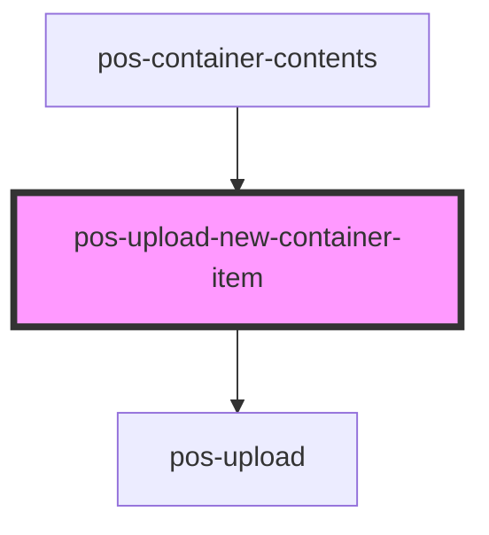

<!-- Auto Generated Below -->

## Properties

| Property                 | Attribute | Description | Type           | Default     |
| ------------------------ | --------- | ----------- | -------------- | ----------- |
| `container` _(required)_ | --        |             | `LdpContainer` | `undefined` |

## Events

| Event                         | Description | Type                |
| ----------------------------- | ----------- | ------------------- |
| `pod-os:upload-dialog-closed` |             | `CustomEvent<void>` |

## Dependencies

### Used by

 - [pos-container-contents](..)

### Depends on

- [pos-upload](../../pos-upload)

### Graph

----------------------------------------------

*Built with [StencilJS](https://stenciljs.com/)*
